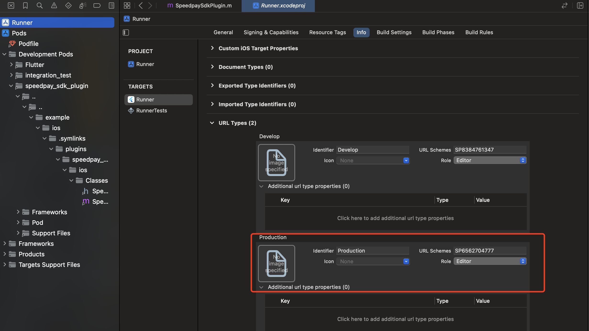

# SpeedPay SDK Flutter集成

## 1. 添加依赖
在pubspec.yaml文件中添加 `speedpay_sdk_plugin` 依赖
``` yaml
dependencies:
  flutter:
    sdk: flutter
    
    speedpay_sdk_plugin:
      git:
        url: 'https://github.com/SpeedGroup/Speedpay_sdk_plugin.git'
        ref: 'v1.0.0'
```

## 2.调用支付方法
调用业务接口获取到支付参数后，调用SDK方法
```dart
Map<String, dynamic> parameters = {
  "appid": appId,
  "partnerid": mchId,
  "prepayid": prepayId,
  "package": "Sign=Pay", // 固定传值
  "nonce_str": "1234567890", // 随机字符串
  "timestamp": (DateTime.now().millisecondsSinceEpoch).toString() // 时间戳
};
parameters["sign"] = _sign(parameters);
var resultCode = await _speedpaySdkPlugin.payOrder(parameters);
if (resultCode?.toUpperCase() == "SUCCESS") {
  debugPrint("支付成功!");
} else if (resultCode?.toUpperCase() == "USER_CANCEL") {
  debugPrint("用户取消!");
} else {
  debugPrint("其他结果：$resultCode");
}
```

## 3. ResultCode定义
`SUCCESS`代表成功，`USER_CANCEL`代表用户取消，其他结果代表失败，具体失败原因错误码查看接口文档

## 4.iOS工程配置
用Xcode打开iOS Runner工程，选择你的工程设置项，选中“TARGETS”一栏，在“info”标签栏的“URL type“添加“URL scheme”，值设置为SpeedPay给商户分配的app id（如下图）。
